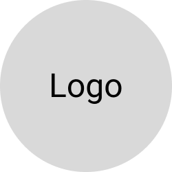

  
  <h1>project-title</h1>
  
project-description

  

    
  

  

    <a href="https://github.com/github_username/repo_name">View Demo</a>
    ·
    <a href="https://github.com/github_username/repo_name/issues">Report Bug</a>
    ·
    <a href="https://github.com/github_username/repo_name/issues">Request Feature</a>
  

  

---

## 📖 Table of Contents

- [Features](#✨-Features)
- [Prerequisites](#🎯-Prerequisites)
- [Installation](#🛠️-Installation)
- [Usage](#⚡️-Usage)
- [Commands](#🕹-Commands)
- [FAQs](#❓-FAQs)
- [License](#📜-License)

## ✨ Features

✅ Feature 1

✅ Feature 2

✅ Feature 3

## 🎯 Prerequisites

## 🛠️ Installation

## ⚡️ Usage

## 🔧 API

## 🕹 Commands

## ❓ FAQs

## 📜 License

[MIT](LICENSE)
